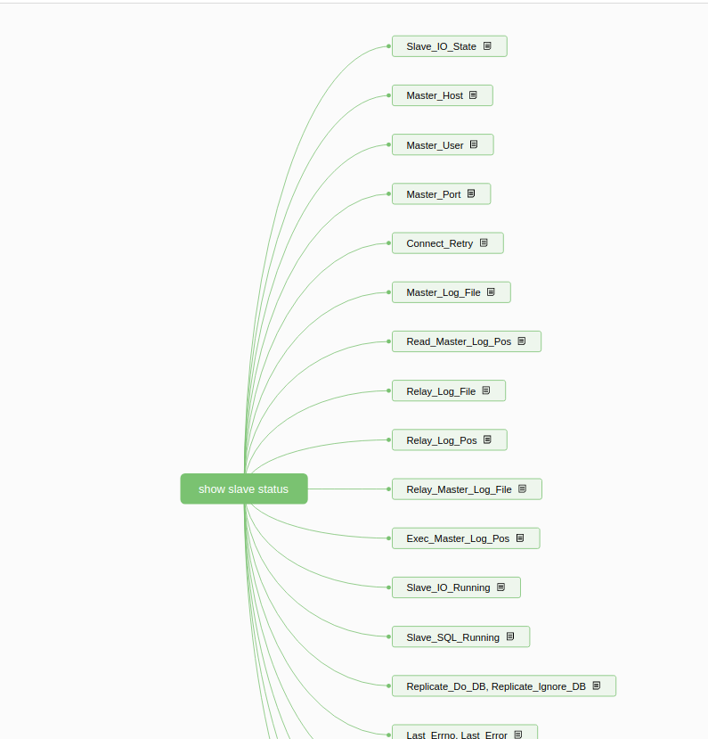

# 概述:

# 详细描述
## Slave_IO_State
slave IO线程状态

## Master_Host
master服务器

## Master_User
哪个用户连接到master

## Master_Port
连接主节点的端口

## Connect_Retry
重试时间，可在change master中设置

## Master_Log_File
IO线程正在读取master节点的日志文件

## Read_Master_Log_Pos
读取master日志文件的位置

## Relay_Log_File
从节点sql线程读取和执行的中继日志的文件

## Relay_Log_Pos
sql线程执行中继日志的位置

## Exec_Master_Log_Pos
刚sql线程执行的sql在master日志的位置

## Slave_IO_Running
slave线程是否启动并连接到master节点，
如下三种状态:  
MYSQL_SLAVE_NOT_RUN：IO线程未启动  
MYSQL_SLAVE_RUN_NOT_CONNECT：IO线程启动但未连接到master  
MYSQL_SLAVE_RUN_CONNECT：IO线程启动并连接，此时显示为yes    

## Slave_SQL_Running
sql线程是否启动

## Replicate_Do_DB, Replicate_Ignore_DB
过滤，相同作用的还有
Replicate_Do_Table,
Replicate_Ignore_Table, Replicate_Wild_Do_Table, Replicate_Wild_Ignore_Table

## Last_Errno, Last_Error
上次sql线程错误，是Last_SQL_Errno，Last_SQL_Error别名

## Relay_Log_Space
中继日志总大小

## Until_Condition
sql线程执行终止条件，与下面结合
Until_Log_File：执行终止日志
Until_Log_Pos：执行终止位置

## Seconds_Behind_Master
从库执行同一事件的时间与主库时间差，该统计是不准确的。但如果(Relay_Master_Log_File, Exec_Master_Log_Pos)和(Master_Log_File, Read_Master_Log_Pos)位置相等且Seconds_Behind_Master=0，那么我们可以认为主备是完成同步的，可以进行切换。

## Replicate_Ignore_Server_Ids
忽replicate-do-table是从sql线程过滤。

## Relay_Master_Log_File
sql线程正在执行的在master节点的日志文件

## Slave_IO_State
slave IO线程状态

## Master_Host
master服务器

## Master_User
哪个用户连接到master

## Master_Port
连接主节点的端口

## Connect_Retry
重试时间，可在change master中设置

## Master_Log_File
IO线程正在读取master节点的日志文件

## Read_Master_Log_Pos
读取master日志文件的位置

## Relay_Log_File
从节点sql线程读取和执行的中继日志的文件

## Relay_Log_Pos
sql线程执行中继日志的位置

## Exec_Master_Log_Pos
刚sql线程执行的sql在master日志的位置略某些主节点的事务，该设置是从IO线程开始过滤的，而replicate-do-table是从sql线程过滤。

## Relay_Master_Log_File
sql线程正在执行的在master节点的日志文件
