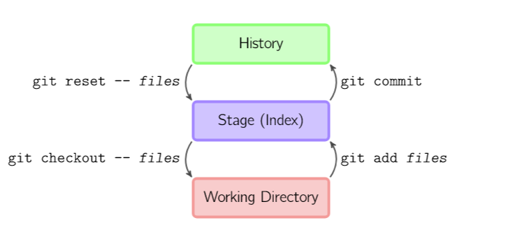

<!-- TOC depthFrom:1 depthTo:6 withLinks:1 updateOnSave:1 orderedList:0 -->

- [1. 初始化仓库](#1-初始化仓库)
- [2.与远程仓库建立连接](#2与远程仓库建立连接)
- [3.各种撤回](#3各种撤回)
- [4.分支管理](#4分支管理)
- [5.bug分支](#5bug分支)

<!-- /TOC -->

---------------------------------

# 1. 初始化仓库

- git init  

- 创建裸仓库
git init --bare my-project.git

# 2.配置

- 配置用户名　　
　git config --global user.name <name>

- 配置邮箱　　
　git config --global user.email <email>　　

- 配置git调用编辑器　　
git config --global --edit

# 3.与远程仓库建立连接

- git remote add origin https://github.com/minghuan2046/note.git   
    其中origin是远程别称，url是远程仓库地址

- git push -u origin master
    将本地分支推向远程master分支，并且与远程master分支建立关联

# 3.各种撤回  
- ## 撤销未被跟踪的文件
    git clean -n  
    列出未被跟踪的文件  
    git clean -f  
    移除当前目录下未被跟踪的文件  

- ## 撤回工作区的修改  
  git checkout file1     
  这里有两种可能:  
  - 暂存库中没有该文件记录，则文件退回到与版本库中一致  
  - 暂存库中有该文件的记录，则工作区中的记录与暂存区中记录一致

- ## 撤回暂存区的修改
  git reset HEAD readme.md   
  - HEAD表示最新版本，上述语句表示将暂存区的修改退回到上一版本，此时工作区还未被回退,再通过git checkout -- ×××撤回工作区的修改。
  - 直接将暂存区和工作区退回到上一个版本
  git reset --hard HEAD

- ## 放弃本地所做的修改，与远程仓库保持一致
  一. 通过git reflog 查询得到远程仓库最后提交的版本号，通过执行
    git reset --hard ××× 回退  
  二. 通过回到之前的版本再git pull

- ## 退回到之前的某一版本
   - 退回一个版本： git reset --hard HEAD^
   - 退回多个版本： git reset --hard ×××  
   注意--与hard之间不能有空格

- ## 查看git日志
     - git log  
     查看每次提交的日志
     - git reflog
     查看所有活动日志
     - git log --oneline

- ## checkout详解
    #### checkout 提价层面
    版本回看: git checkout ×××
    此时处于分离头状态，即HEAD不再指向一个分支，而是指向某一个提交。
    查看完之后重新让头指向分支:git checkout master

    #### checkout 文件层面
    检出文件的某一版本： git checkout ××× file1
    重新与版本库一致: git checkout HEAD file1
    撤销工作区修改:git ckeckout file1
    这里有两种可能:  
    - 暂存库中没有该文件记录，则文件退回到与版本库中一致  
    - 暂存库中有该文件的记录，则工作区中的记录与暂存区中记录

- ## reset详解(用在私有分支)
  #### reset提交层面
  git reset ××××
  reset是将分支末端指向另一个提交，可通过以下标记影响工作区和暂存区是否受影响,参数只针对提交层面操作起作用，针对文件层面操作无效。
  - --soft – 缓存区和工作目录都不会被改变
  - --mixed – 默认选项。缓存区和你指定的提交同步，但工作目录不受影响
  - --hard – 缓存区和工作目录都同步到你指定的提交
  ##### reset 文件层面
  git reset file1  
  作用：取消特定文件的缓存，不影响工作区。  

  **警告：reset 会重写版本，一般只能使用在本地更改，不能在公共分支上使用**

- ## revert详解(用在公共分支)　　
　git revert HEAD^2
　撤销两个提交，在撤销之前会先创建一个提交。撤销特定提交的更改。

  git revert ×××
  撤销指定的提交

  **revert在撤销某一提交的同时创建一个提交，所以提交历史都存在，所以是安全的方式。**

# 4.分支管理
- ## 创建并切换分支  
  git checkout -b dev
  新建dev分支并切换到dev

- ## 切换分支
  git checkout dev  

- ## 合并分支
  git merge dev

- ## 删除分支  
  git branch -d dev

# 5.bug分支
- git stash  
  保存工作现场(工作区)
- git stash list  
  列举工作现场
- git stash pop  
  恢复现场
- git stash apply stash@{0}
  恢复到指定现场
- git stash drop stash@{0}
  删除指定现场，其中通过git stash pop恢复的被被自动删除，通过git stash apply恢复的需要手动删除

# 6.图解git  

- git仓库结构  

###[参考地址](https://github.com/geeeeeeeeek/git-recipes/wiki)
