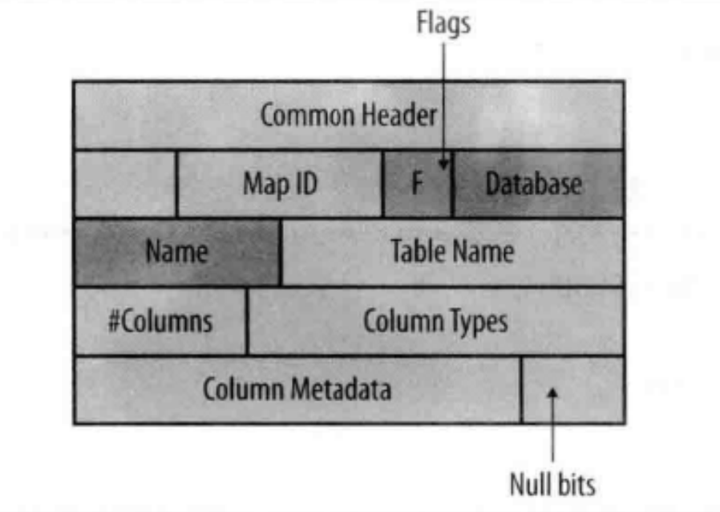
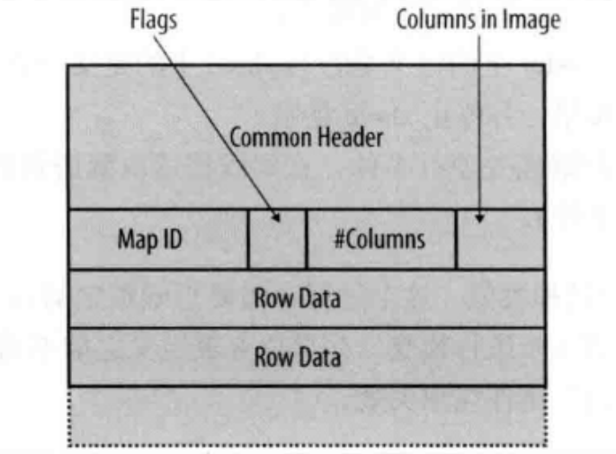
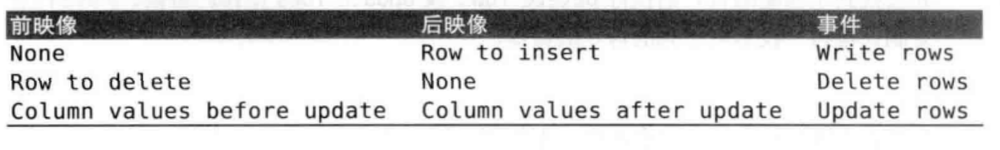

1. Table_map
将表ID映射为表名（包括数据库名），以及关于master上的表的列的基本信息。表信息不包括列名，只有列类型，
因为基于行的复制是位置性的，即master上每个列的相同位置被复制到slave表。

  
- 列类型数组（Column Types）：表示所有列基础类型数组，但长度信息存在列元数据中  
- 空比特数组（Null bits）：表示每个字段是否为空
- 列元数据（column metadata）：充实列类型数组的细节信息。例如DECIMAL类型保存进度和小数等

注意：
整型字段类型是否有符号，字符串类型字符集未记录，因此如果master，slave使用两种不同的字符集，会导致意想不到的结果，slave只负责插入字节，没法检查插入的字节

2. Write_rows，Delete_rows和Update_rows
 在更新，删除，插入时生成这些事件，单个语句能产生多个事件。除了行以外，每个事件还有一个表ID，表ID存储在Table_map事件中
。还有一个列位图，记录影响变动的列。

Columns:列位图，这个字段能使master对每行选择不同的字段发送。其中列位图有两种，即前印象，后印象。其使用场景如下：

在MySQL5.6.2之前，只有MySQL集群引擎限制写入日志的列。在5.6.2之后，可通过binlog-row-image参数控制写入日志的列。
- full：默认值，复制全部列。5.6.2之前按照这种方式写入。
- noblob:忽略blob类型，除非他们需要更新。
- minimal:只有主键和更改列的那些列才被写入二进制日志。

full和minimal使用场景区别是master和slave上是否使用了一样的索引。
