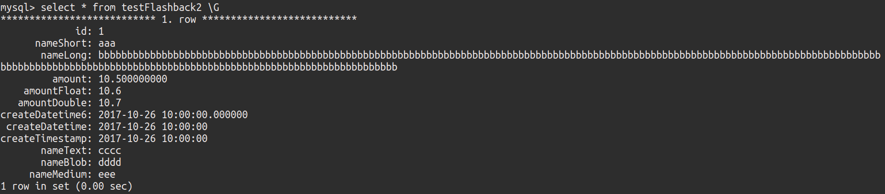
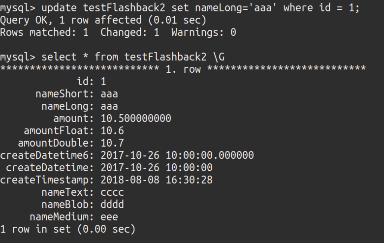
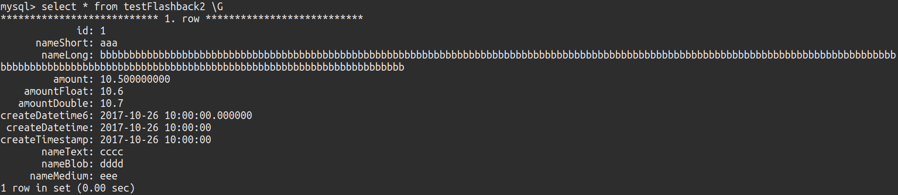

<!-- TOC depthFrom:1 depthTo:6 withLinks:1 updateOnSave:1 orderedList:0 -->

- [介绍](#介绍)
- [安装](#安装)
	- [下载源码](#下载源码)
	- [替换一下低版本的一个依赖](#替换一下低版本的一个依赖)
- [使用](#使用)
		- [向MySQL中新建一个数据表](#向mysql中新建一个数据表)
		- [插入一条数据](#插入一条数据)
		- [更新该条数据](#更新该条数据)
		- [通过mysqlbinlog找到该语句在binlog中的位置](#通过mysqlbinlog找到该语句在binlog中的位置)
		- [通过MyFlash工具生成该语句的反向语句](#通过myflash工具生成该语句的反向语句)
		- [数据恢复](#数据恢复)
- [拓展](#拓展)
		- [MyFlash参数](#myflash参数)

<!-- /TOC -->
# 介绍
1. 支持MySQL5.6,5.7版本
2. 支持insert，update，delete操作回滚
3. 支持多种过滤
4. 不经过文本转换，直接进行binlog的反向解析

限制：
1.binlog格式必须为row,且binlog_row_image=full  
2.仅支持5.6与5.7  
3.只能回滚DML（增、删、改）  

# 安装
## 下载源码
git clone https://github.com/Meituan-Dianping/MyFlash.git

## 替换一下低版本的一个依赖
cd  MyFlash  
./build.sh

可查看在binary目录下有一个可执行的flashback文件。

# 使用
### 向MySQL中新建一个数据表
```
CREATE TABLE `testFlashback2` (
  `id` int(11) NOT NULL AUTO_INCREMENT,
  `nameShort` varchar(20) DEFAULT NULL,
  `nameLong` varchar(260) DEFAULT NULL,
  `amount` decimal(19,9) DEFAULT NULL,
  `amountFloat` float DEFAULT NULL,
  `amountDouble` double DEFAULT NULL,
  `createDatetime6` datetime(6) DEFAULT NULL,
  `createDatetime` datetime DEFAULT NULL,
  `createTimestamp` timestamp NOT NULL DEFAULT CURRENT_TIMESTAMP ON UPDATE CURRENT_TIMESTAMP,
  `nameText` text,
  `nameBlob` blob,
  `nameMedium` mediumtext,
  PRIMARY KEY (`id`)
) ENGINE=InnoDB
```
### 插入一条数据
```
insert into testFlashback2(nameShort,nameLong,amount,amountFloat,amountDouble,createDatetime6,createDatetime,createTimestamp,nameText,nameBlob,nameMedium) values('aaa','bbbbbbbbbbbbbbbbbbbbbbbbbbbbbbbbbbbbbbbbbbbbbbbbbbbbbbbbbbbbbbbbbbbbbbbbbbbbbbbbbbbbbbbbbbbbbbbbbbbbbbbbbbbbbbbbbbbbbbbbbbbbbbbbbbbbbbbbbbbbbbbbbbbbbbbbbbbbbbbbbbbbbbbbbbbbbbbbbbbbbbbbbbbbbbbbbbbbbbbbbbbbb',10.5,10.6,10.7,'2017-10-26 10:00:00','2017-10-26 10:00:00','2017-10-26 10:00:00','cccc','dddd','eee');
```

查询结果：



### 更新该条数据
update testFlashback2 set nameLong='aaa' where id = 1;

查询结果:  


### 通过mysqlbinlog找到该语句在binlog中的位置
具体做法参照mysqlbinlog的用法。  
最终找到所在文件为：mysql-bin.000004
起始位置为:623
截止位置为：1191

### 通过MyFlash工具生成该语句的反向语句
```
./flashback --start-position=623 --stop-position=1191 --binlogFileNames=/home/work/mh/mysql5.6/log/mysql-bin.000004
```
最终生成一个文件:
binlog_output_base.flashback  
该文件即为最终的反向解析语句，最后将该语句重放到数据库即可完成数据恢复

### 数据恢复
```
/home/work/mh/mysql5.6/bin/mysqlbinlog binlog_output_base.flashback |mysql -h 127.0.0.1 -P3370 -uroot
```
查询数据：


通过观察即可得到更新之前的数据。

# 拓展
### MyFlash参数
```
--databaseNames             databaseName to apply. if multiple, seperate by comma(,)
--tableNames                tableName to apply. if multiple, seperate by comma(,)
--start-position            start position
--stop-position             stop position
--start-datetime            start time (format %Y-%m-%d %H:%M:%S)
--stop-datetime             stop time (format %Y-%m-%d %H:%M:%S)
--sqlTypes                  sql type to filter . support INSERT, UPDATE ,DELETE. if multiple, seperate by comma(,)
--maxSplitSize              max file size after split, the uint is M
--binlogFileNames           binlog files to process. if multiple, seperate by comma(,)
--outBinlogFileNameBase     output binlog file name base
--logLevel                  log level, available option is debug,warning,error
--include-gtids             gtids to process
--exclude-gtids             gtids to skip
```
