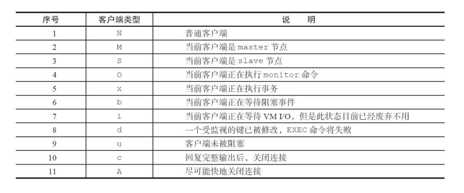

# 一.初识Redis

# 二.API的理解与使用

# 三.小功能大用处
## 3.1 慢日志（只是执行时间，不包括排队时间等）
- slowlog-log-slower-than:配置慢日志执行时间阀值
- slowlog-max-len：慢日志最多条数
### 设置方法
config set slowlog-log-slower-than 20000
config set slowlog-max-len 1000
config rewrite //代表持久化到配置文件中

### 获取方法
slowlog get n

### 重置慢日志
slowlog reset

## 3.2.1 redis-cli详解
```
-r：命令执行多次
eg：
redis-cli -r 3 ping
PONG
PONG
PONG

-i：隔几秒执行一次命令
eg：
redis-cli -r 5 -i 1 ping
PONG
PONG
PONG
PONG
PONG

-x：从标准输入读取作为最后一个参数
eg:
echo "world" | redis-cli -x set hello

-c:连接Redis Cluster节点时需要使用的，-c选项可以防
止moved和ask异常

-a:认证

--rdb：会请求Redis实例生成并发送RDB持久化文件，保存在本地。

--bigkeys:--bigkeys选项使用scan命令对Redis的键进行采样，从中找到内存占用比
较大的键值

--latency:latency有三个选项，分别是--latency、--latency-history、--latency-dist。
它们都可以检测网络延迟

--stat:以实时获取Redis的重要统计信息，
```
## 3.2.2 redis-server详解
```
--test-memory:检测当前系统是否能稳定分配制定大小内存给Redis
eg:
redis-server --test-memory 1024
```

## 3.2.3 redis-benchmark
redis-benchmark:为Redis做基准性能测试
```
-c:客户端连接并发数
-n：客户端请求并发量
eg：redis-benchmark-c100-n20000  
代表100各个客户端同时请求Redis，一
共执行20000次

-q：每秒可执行的请求数
-r:随机插入键，但仅代表对末尾多少位进行随机处理
eg:-r 10000:代表对最后四位进行随机处理。
-t：对指定命令进行基准测试。
eg:
redis-benchmark -t get,set -q
SET: 98619.32 requests per second
GET: 97560.98 requests per second
```

## 3.3 Pipline
将一组命令发送到服务器端执行，从往返上节约时间。

## 3.4 事务
- 以muti开始，exec或者discard结束
- 不支持回滚

lua脚本待学习

## Bitmaps
- setbit key offset value：设置值
- gitbit key offset：获取值
- bitcount [start][end]：获取指定范围为1的数量
- 进行位图运算

# 四.客户端

## 4.4客户端API  
### client list：展示所有客户端连接信息
- id：客户端连接的唯一标识，这个id是随着Redis的连接自增的，重启
Redis后会重置为0。

- addr：客户端连接的ip和端口。
- fd：socket的文件描述符，与lsof命令结果中的fd是同一个，如果fd=-1
代表当前客户端不是外部客户端，而是Redis内部的伪装客户端。
- name：客户端的名字。
- qbuf：输入缓冲区总量，对应client_biggest_input_buf参数
- qbuf-free：输入缓冲区空闲
- obl：固定输出缓冲区长度
- oll：动态输出缓冲区长度，对应client_longest_output_list参数
- omem：输出缓冲区使用总字节数
- age：连接时间
- idle：最近一次空闲时间
- flag：代表客户端类型


### client kill:杀掉指定ip和端口的客户端
### client pause：阻塞客户端timeout毫秒数，在此期间客户端连接将被阻塞。
client pause只对普通和发布订阅客户端有效，对于主从复制（从节点
内部伪装了一个客户端）是无效的，也就是此期间主从复制是正常进行的，
所以此命令可以用来让主从复制保持一致

# 五.持久化
### 5.1 RDB：将当前进程数据生成快照保存到硬盘。
## 5.1.1 触发机制
save：阻塞当前Redis，直到RDB完成为止。
bgsave：创建子进程，生成RDB由子进程完成，阻塞发生在fock阶段。
redis-check-dump：检测RDB文件

### 5.2 AOF:以独立日志的方式记录每次写命令，重启时再重新执行AOF文件中的命令达到恢复数据的目的。
开启配置:appendonly yes
缓冲区同步磁盘策略：appendfsync
- always：每次命令被同步到磁盘后线程才返回
- everysec：触发操作系统延迟写机制，命令写入aof_buf后调用系统write，fsync同步操作由专门的线程调用一次。
- no：命令写入aof_buf后调用write操作，不进行同步文件，同步文件完全由操作系统决定。
